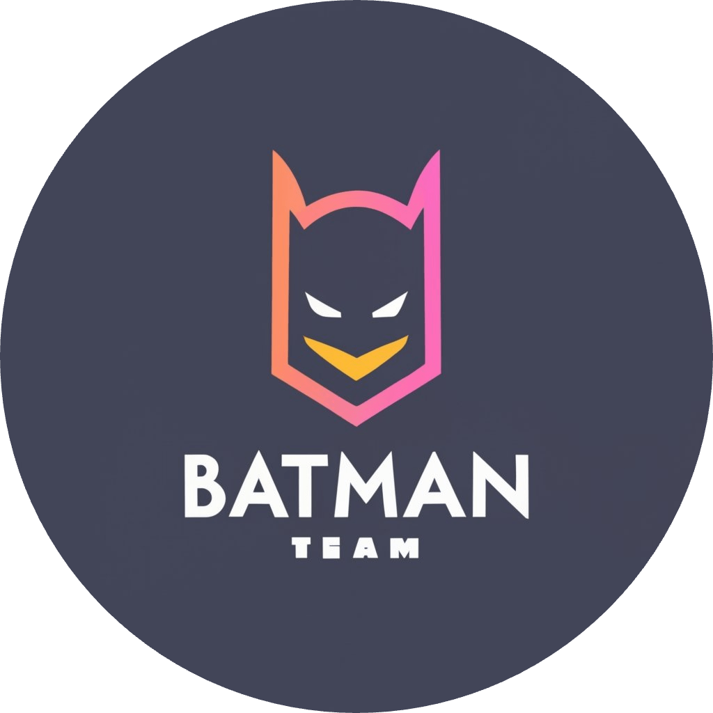
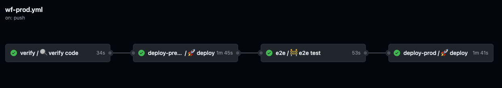
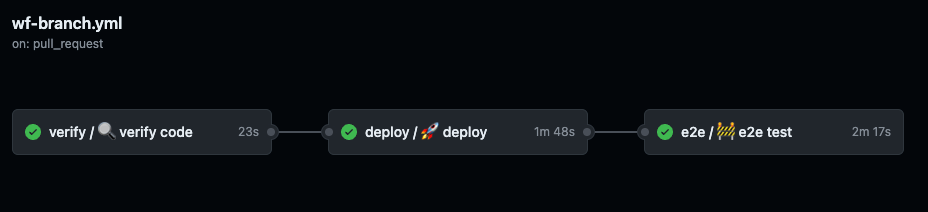

<!-- PROJECT SHIELDS -->

<div align="center">
    
<br/>
<br/>

[](https://team-batman.netlify.app)
[](https://team-batman.onivue.ch)


<br/>

</div>

# Project: Mumble - Social Media App

This is the frontend part of the Mumble project.  
We are a team of students from the CAS Frontend Engineering course at the OST Campus Rapperswil.

## 💻 Stack

- ⚛️ [react](https://reactjs.org/): JavaScript library for building user interfaces.
- ⏩ [next](https://nextjs.org/): React framework for server-side rendering, static site generation, and more.
- 🔒 [next-auth](https://next-auth.js.org/) NextAuth.js is a complete open-source authentication solution for Next.js applications.
- 🎨 [tailwindcss](https://tailwindcss.com/): Utility-first CSS framework for rapidly building custom designs.
- 📘 [typescript](https://www.typescriptlang.org/): Typed superset of JavaScript that compiles to plain JavaScript.
- 💈 [design-system-component-library-team-batman](https://github.com/ost-cas-fee-adv-23-24/design-system-component-library-team-batman): Re-usable design system component library.
- ⚙️ [@headlessui/react](https://headlessui.dev/react/): Completely unstyled, fully accessible UI components, designed to integrate beautifully with Tailwind CSS.
- 🔧 [tailwind-merge](https://www.npmjs.com/package/tailwind-merge): Tailwind CSS plugin for merging utilities.
- 🔗 [clsx](https://www.npmjs.com/package/clsx): Tiny utility for constructing className strings conditionally.
- 🚀 [framer-motion](https://www.framer.com/motion/): Production-ready animation library for React.
- 👮 [eslint](https://eslint.org/): Pluggable and configurable linter tool for identifying and reporting on patterns in JavaScript.
- ✏️ [prettier](https://prettier.io/): Opinionated code formatter that enforces a consistent code style.

## 🔒 Authentication

- we use [NextAuth.js](https://next-auth.js.org/) for authentication
- as IDP we use [Zitadel](https://zitadel.com/)

## 🌍 Deployment

The project is deployed with [Netlify](https://www.netlify.com/).  
Automatically deploys are disabled, we deploy manually via the Netlify CLI in our CI/CD pipeline.

[https://team-batman.netlify.app](https://team-batman.netlify.app)

⚠️ Netlify has some issues with next.js app router, so we decided to deploy on vercel as well but use netlify for our e2e tests, because on vercel we have some limitations with the free plan.

[https://team-batman.onivue.ch](https://team-batman.onivue.ch)

## 🚦 CI/CD (GitHub Actions)

> We use GitHub Actions for our CI/CD pipeline.  
> We have two workflows that helps us Continuously Deploy our project:

<div align="center">

</div>

- **[wf-prod.yml](.github/workflows/wf-prod.yml)**
  - This workflow runs on every push to the main branch.
  - first it verifies the code with eslint & typescript
  - then it builds the project and deploys it to Netlify as a preview
  - then our e2e tests are run on the preview deployment
  - if the tests are successful, the preview deployment is promoted to production

<div align="center">

</div>

- **[wf-branch.yml](.github/workflows/wf-branch.yml)**
  - This workflow runs on every pull request to the main branch.
  - first it verifies the code with eslint & typescript
  - then it builds the project and deploys it to Netlify as a preview
  - then our e2e tests are run on the preview deployment

> With this steps we ensure a high quality of our code and that our main branch is always deployable.

## 🚀 Run Locally

1. Clone the repository:

```sh
git clone https://github.com/ost-cas-fee-adv-23-24/nextjs-app-team-batman
```

2. Install the dependencies with one of the package managers listed below:

```bash
npm install
```

3. set environment variables in a `.env.local` file in the root

   - [.env.local.example](.env.local.example)

4. Start the development mode:

```bash
npm run dev
```

4. Open [http://localhost:3000](http://localhost:3000) with your browser to see the result.

### 💡 Tipp

Don't forget to install the recommended extensions for vscode [**.vscode/extensions.json**](.vscode/extensions.json)

## 🚀 Build

```bash
npm run build
npm run start
```

## 🙌 Maintainers (Team Batman)

<table style="border:1px solid #404040;text-align:center;width:100%">
<tr><td style="width:14.29%;border:1px solid #404040;">
        <a href="https://github.com/onivue" spellcheck="false">
          
          <br />
          <b>onivue</b>
        </a>
        <br />
        <a href="https://github.com/ost-cas-fee-adv-23-24/design-system-component-library-team-batman/commits?author=onivue" title="Contributions" spellcheck="false">
          contributions
        </a>
      </td><td style="width:14.29%;border:1px solid #404040;">
        <a href="https://github.com/risuiar2023" spellcheck="false">
          
          <br />
          <b>risuiar2023</b>
        </a>
        <br />
        <a href="https://github.com/ost-cas-fee-adv-23-24/design-system-component-library-team-batman/commits?author=risuiar2023" title="Contributions" spellcheck="false">
         contributions
        </a>
      </table>

## 📄 License

This project is licensed under the **MIT License** - see the [**MIT License**](https://github.com/ost-cas-fee-adv-23-24/design-system-component-library-team-batman/blob/main/LICENSE) file for details.
